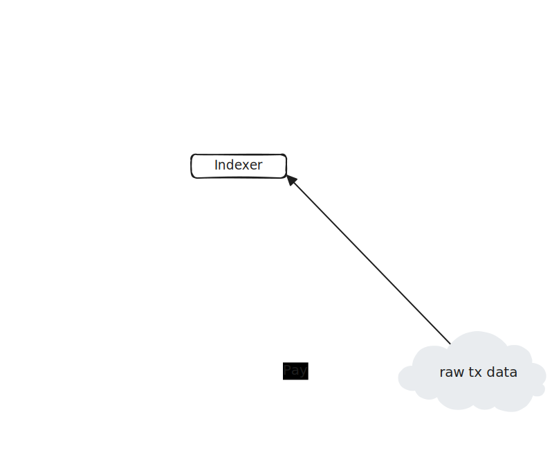

# Pontis

`OP_CAT` enabled Bitcoin &lt;> Starknet Bridge POC

## Intro

These POC builds of previous [Bridge Covenant POC](https://starkware.co/blog/implementing-a-bridge-covenant-on-op-cat-bitcoin/). It explores "easy" parts of the potentatial bridge implementation, ignoring more difficult parts of the design like dual finality, reorgs etc.

## Limitations

* only happy path is tested/implemented, problems with sending transactions are ignored
* there is a bridge instance constraint missing in the deposit covenant, right now there is no way to specify which bridge instance deposit is meant to be added to after aggregation
* deposit/withdrawal amount is limited to int32.max, this applies also to a deposit/withdrawal batch total
* there might be only 16 'open' deposit batches
* deposit batch size should be a power of 2
* withdrawal amount should be bigger than what l1 considers dust (330)

## Architecture

<p align="center" width="100%">
  
</p>

## Covenants

<p align="center" width="100%">
  
</p>

## How To Run Locally

### Operator

1. Go to operator dir:<\br>```cd operator```
2. Copy config file and set private keys:<\br>```cp .env-example .env```
3. Install deps:<\br>```yarn install```
4. Run devnet:<\br>```yarn run devnet```
5. Deploy L2 contracts:<\br>```yarn run command deploy```
6. Start operator (in another terminal):<\br>```yarn run poc```

### Dashboard

1. Go to dashboard dir:<\br>```cd dashboard```
2. Install deps:<\br>```yarn install```
3. Run dashboard server:<\br>```yarn dev```

### Test Deposit Flow

1. Make sure Alice account is well funded
2. Initiate several deposits:<\br>```yarn command deposit 1000```<\br>:```yarn command deposit 1000```<\br>:```yarn command deposit 1000```<\br>:```yarn command deposit 1000```

### Test Withdrawal Flow
1. Execute Deposit flow first
2. Initiate several withdrawals:<\b>```yarn command withdraw 500```<\br>```yarn command withdraw 500```<\br>```yarn command withdraw 500```<\br>```yarn command withdraw 500```<\br>

